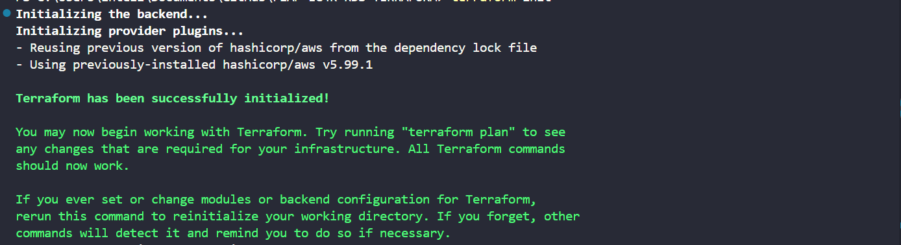
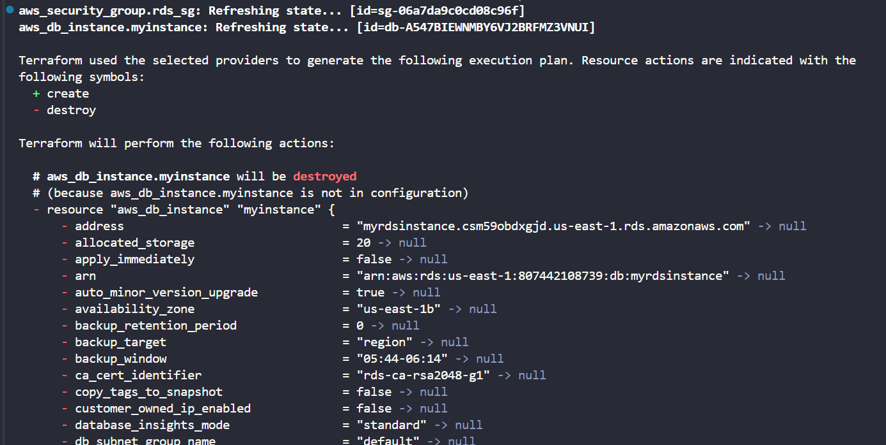
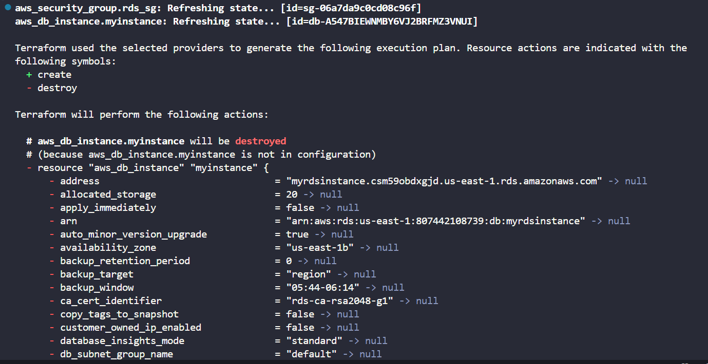
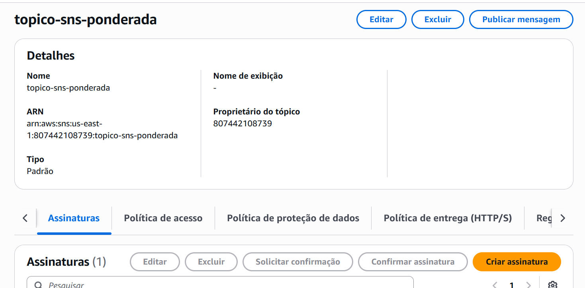
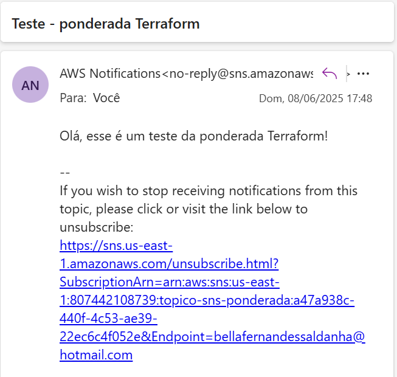
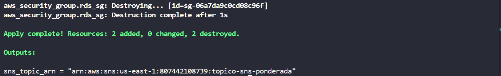

## Projeto Terraform AWS SNS - Criando tópico e assinatura de Email

### Objetivo

Este projeto tem como objetivo demonstrar o provisionamento de um tópico SNS (Simple Notification Service) na AWS utilizando Terraform. O tópico criado envia notificações por email para um assinante configurado.

## Passo a passo da execução

### 1. Configurar variáveis de ambiente AWS

Configure suas credenciais e região da AWS para que o Terraform consiga autenticar e executar os comandos.

```bash
export AWS_ACCESS_KEY_ID="seu_access_key"
export AWS_SECRET_ACCESS_KEY="sua_secret_key"
export AWS_SESSION_TOKEN="seu_session_token" 
export AWS_DEFAULT_REGION="sua_regiao"
```

### 2. Inicializar o Terraform

Execute o comando para inicializar o Terraform e baixar os providers necessários.

```bash
terraform init
```

<div align="center">
  <sub>Output do terraform init</sub>
  
</div>

### 3. Planejar a configuração

Planeje a configuração para implementação do código Terraform.

```bash
terraform plan
```

<div align="center">
  <sub>Output do terraform plan</sub>
  
</div>

### 4. Aplicar a infraestrutura

Execute o comando para criar os recursos na AWS.

```bash
terraform apply
```

O Terraform irá mostrar o que será criado. Confirme digitando `yes`.

<div align="center">
  <sub>Output do terraform apply</sub>
  
</div>

### 5. Conferir o tópico e assinatura no Console AWS

No Console AWS:

* Navegue até o serviço SNS.
* Confira o tópico criado com o nome configurado.
* Verifique a assinatura de email criada.

<div align="center">
  <sub>Print da tela do SNS</sub>
  
</div>

### 6. Testar o envio de mensagens

No Console SNS:

* Acesse o tópico criado.
* Clique em "Publicar mensagem".
* Escreva um título e mensagem.
* Envie para testar o recebimento do email.

<div align="center">
  <sub>Print do email recebido</sub>
  
</div>

## Recursos provisionados na AWS

1. **Tópico SNS:**

   * Nome: `meu-topico-sns-exemplo`
   * ARN: exibido no output do Terraform

2. **Assinatura SNS:**

   * Protocolo: email
   * Endpoint: seu email configurado

### Outputs do Terraform

* `sns_topic_arn` — ARN do tópico SNS criado.

<div align="center">
  <sub>Output do Terraform</sub>
  
</div>

## Considerações finais

Este projeto exemplifica a criação de recursos AWS simples via Terraform aplicado ao envio de notificações básicas e testes.

